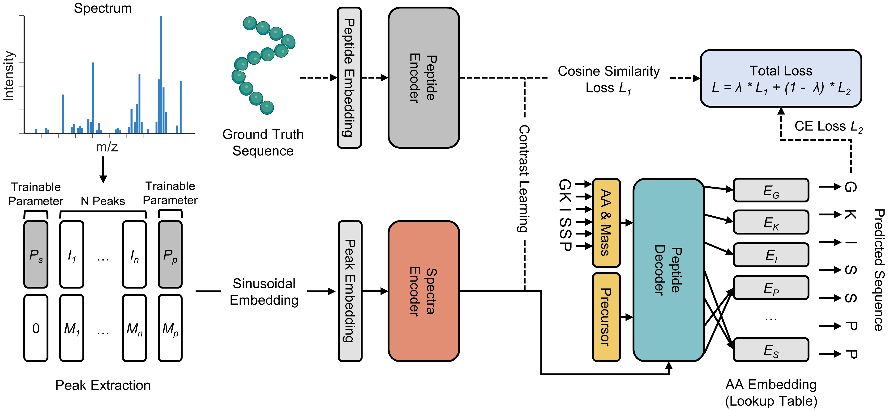

## ContraNovo: A Contrastive Learning Approach to Enhance De Novo Peptide Sequencing

This repository contains inference code for **A Contrastive Learning Approach to Enhance De Novo Peptide Sequencing (ContraNovo)**



#### Reproduce Steps

- Get resource and create the conda environment.

  ```
  git clone git@github.com:BEAM-Labs/ContraNovo.git
  cd ContraNovo
  conda env create -f environment.yml
  conda activate ContraNovo
  ```

- Download ContraNovo checkpoint  and Bacillus.10k.mgf from google drive.

  ContraNovo.ckpt ：https://drive.google.com/file/d/1knNUqSwPf98j388Ds2E6bG8tAXx8voWR/view?usp=drive_link
  
  Bacillus.10k.mgf : https://drive.google.com/file/d/1HqfCETZLV9ZB-byU0pqNNRXbaPbTAceT/view?usp=drive_link

- Run ContraNovo test on bacillus.10k.mgf

  ```
  python -m ContraNovo.ContraNovo  --mode=eval --peak_path=./ContraNovo/bacillus.10k.mgf --model=./ContraNovo/ContraNovo.ckpt
  ```

  

